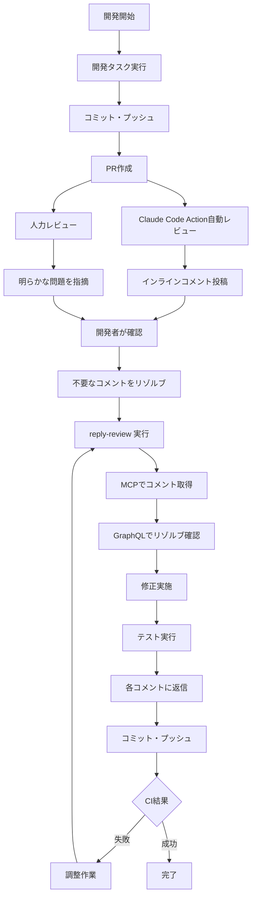
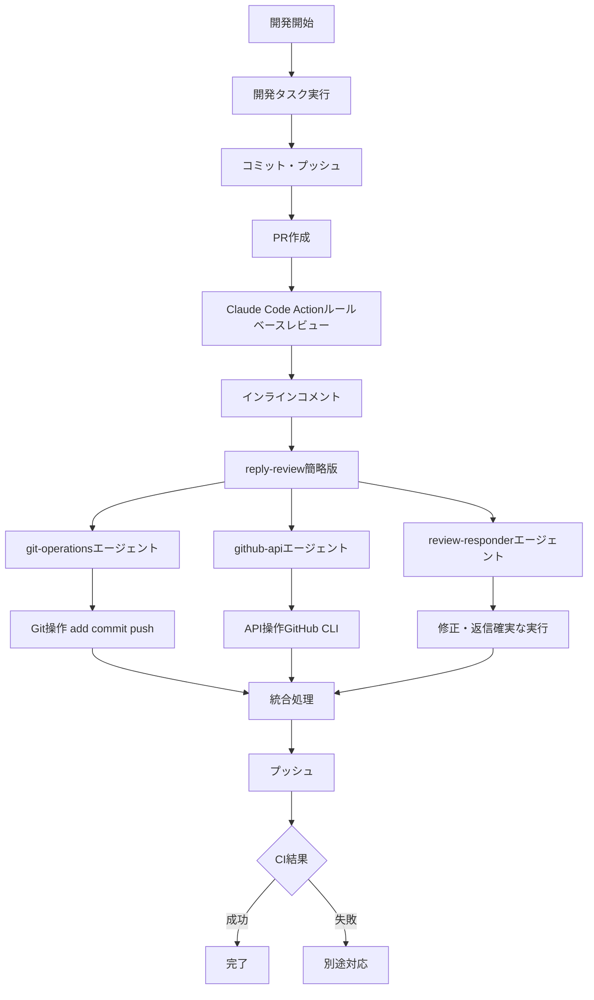

# 自動コードレビューとレスポンスプロセスの最適化

## 仮説の概要
人間を介さない自動コードレビューシステムを構築し、開発ルールに沿った品質を保ちながら、レビューへの対応を効率化する。Claude Code Actionによる自動レビューとreply-reviewコマンドの連携を最適化することで、品質と効率の両立を実現する。

## 現状の課題

### 1. 自動レビューの品質問題
- **オーバーテスト**: 過剰なテスト要求による開発速度の低下
- **ルール適用の不一致**: プロジェクト固有のルールが反映されない
- **コンテキスト理解不足**: 変更の意図を理解せずに機械的なレビュー

### 2. レビュー対応プロセスの問題
- **GraphQLクエリーの失敗**: リゾルブ状態確認が頻繁に失敗
- **返信忘れ**: 長文指示による認識ミス
- **Git操作の複雑性**: 複数のAPIとツールの組み合わせ
- **未解決レビューの探索困難**: レビューが反復されると、未解決（unresolved）のインラインレビューを見つけられなくなる

### 3. 効率性の問題
- **手動介入の必要性**: 自動化が不完全で人間の確認が必要
- **反復作業**: 同じようなレビューコメントへの対応の繰り返し

## ワークフローの図解

### 1. 現状のワークフロー（変更前）

### 2. 改善予定のワークフロー

## 改善に必要な要素

### 削除する要素

#### カスタムコマンド（reply-review）から削除
- GraphQLクエリーによるリゾルブ状態確認処理
- 110行に及ぶ詳細な指示文
- 複雑なMCP/API連携の直接記述

### 追加する要素

#### 新規サブエージェント
1. **git-operations エージェント**
   - Git操作（add, commit, push等）の専門化
   - エラーハンドリングとリトライの実装
   - ブランチ操作とマージ処理

2. **github-api エージェント**
   - GitHub API操作の専門化
   - GitHub CLIを優先的に使用
   - PR、Issue、コメント操作の統合

3. **review-responder エージェント**
   - レビューコメントへの返信に特化
   - 未解決コメントの確実な追跡
   - 修正内容の明確な説明

#### カスタムコマンドの簡略化
- reply-reviewコマンドを10行程度に圧縮
- サブエージェントへの処理委譲を明記
- 引数の受け渡しのみに専念

## 実装ファイル

### 更新されたコマンド
- [/commands/reply-review-v2.md](/commands/reply-review-v2.md) - サブエージェントを活用した簡略化版

### サブエージェント定義
- [/agents/git-operations.md](/agents/git-operations.md) - Git操作専門エージェント
- [/agents/github-api.md](/agents/github-api.md) - GitHub API操作専門エージェント  
- [/agents/review-responder.md](/agents/review-responder.md) - コードレビュー対応専門エージェント